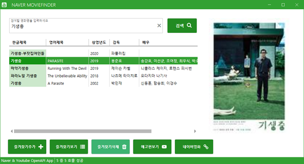
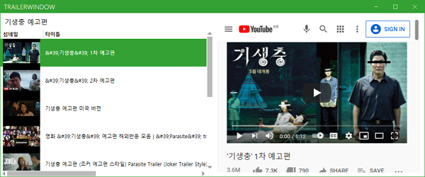
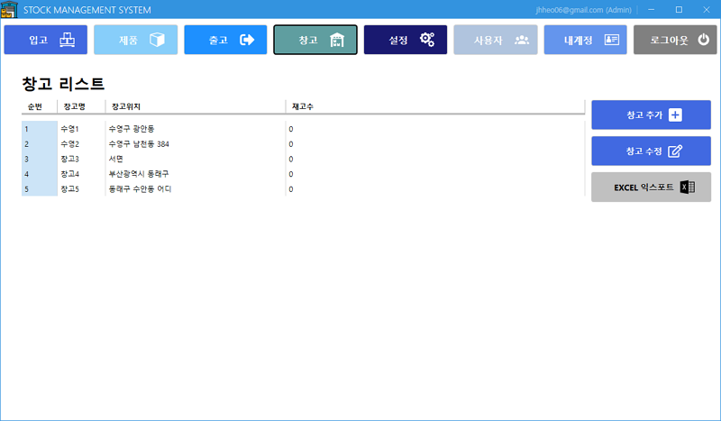
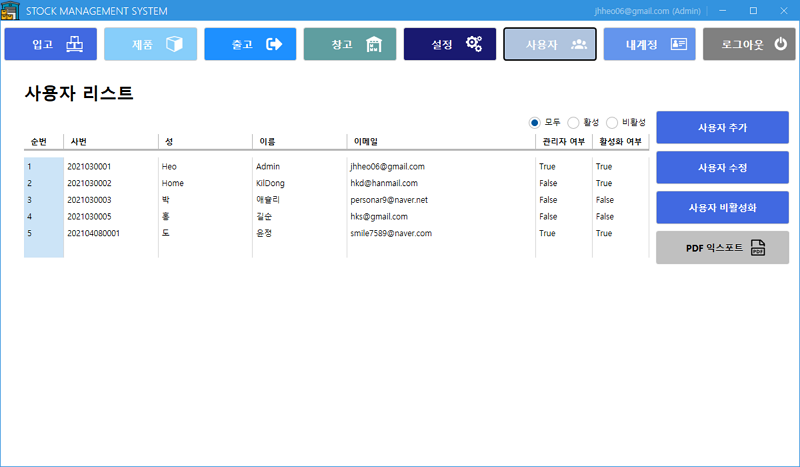

# ✅ MiniProject_Desktop ✅ 

## 🎬 MovieFinder App 
#### <메인화면>
  
#### <Youtube OpenApi 활용 - 예고편 보기>  

* [MovieFInderApp Code](https://github.com/JaehyeonHeo/MiniProject_Desktop/tree/main/WpfMiniProject/NaverMovieFinderApp "소스코드")  

## 📦 StockManagementSystem App (ERP 재고관리) 

#### <실행화면>

* [StockManagemet SYSTEM Code](https://github.com/JaehyeonHeo/MiniProject_Desktop/tree/main/WpfSMSApp/WpfSMSApp "소스코드") 

_____________________________________________
## [🔙뒤로]( https://github.com/JaehyeonHeo)
